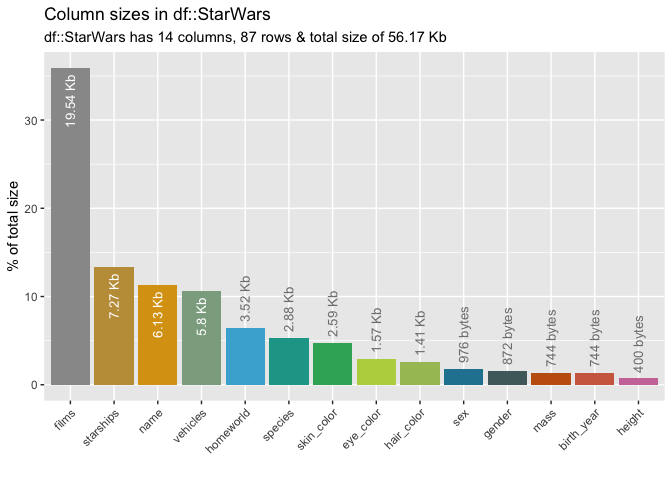
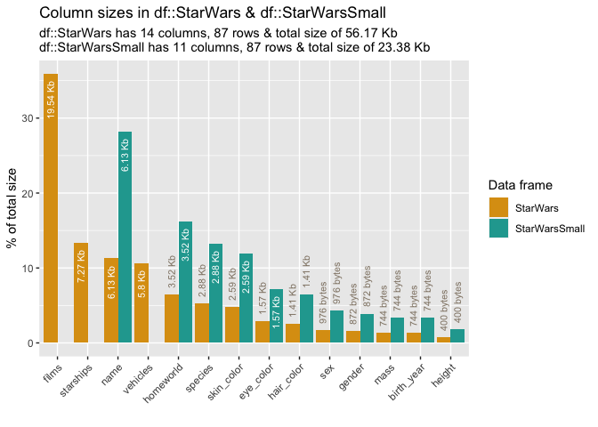
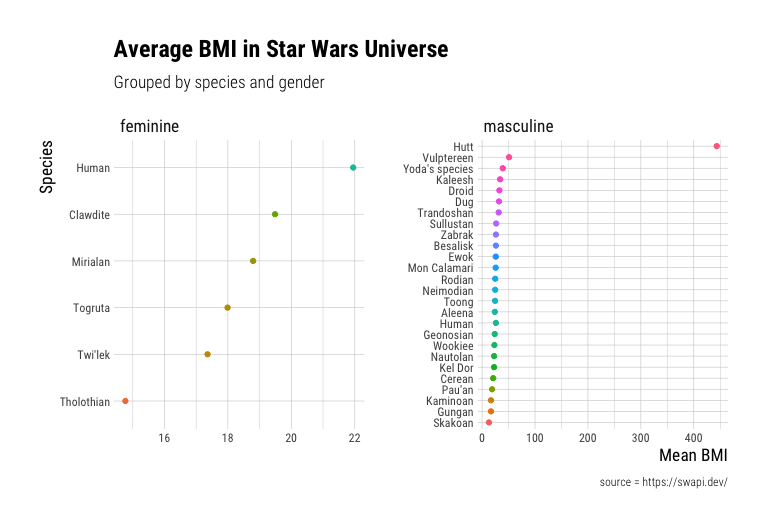

# Objectives

This document provides some exercises to improve your understanding of R Markdown. Please see the [accompanying slides](https://mjfrigaard.github.io/rep-res-rmarkdown.github.io/Index.html#1) for more information.

## Create a new R Markdown file {.tabset}

We will start by creating a new R Markdown file, and set it to create an HTML document.

### New File icon

We can create a new R Markdown file using the *New File* icon


### File tab

We can also create a new R Markdown file in RStudio using *File* \> *New File* \> *R Markdown...*


### Save your .Rmd file

We will need to save our `.Rmd` file before we can knit it, so we'll save it in the same directory as this `rmarkdown-solutions.html` file.


**Be sure to delete all the text beneath the YAML header in your new .Rmd document**

------------------------------------------------------------------------

## RMarkdown: YAML {.tabset}

While R Markdown allows us to create a variety of documents formats, the output with the most features is HTML. HTML documents function essentially like a web page, and allow for interactive navigation and displays. This document was written in R Markdown, and we'll be creating a similar report to keep as a reference.

### Standard YAML Header

Our new `.Rmd` file should have the following information. *Note that indentation and case matters in YAML formatting, so we need to pay extra attention to alignments and spelling.*

``` {.yaml}
---
title: "Untitled"
author: "Martin Frigaard"
date: "10/24/2020"
output: html_document
---
```

**Be sure to delete all the text beneath the YAML header in your new .Rmd document**

### Table of Contents (TOC)

Having an interactive table of contents makes it easier for readers to navigate your report. We can add a floating table of contents to our new report to the following YAML settings:

``` {.yaml}
output: 
  html_document: 
    toc: yes
    toc_float: true
```

*Knit* the document again and extend the view to see the floating table of contents.

### Highlight & Themes

Highlighting and themes give us some control over the aesthetics in our reports. We can add a new theme and text highlighting to the report with the following YAML options.

``` {.yaml}
output: 
  html_document: 
    toc: yes
    toc_float: yes
    highlight: spacelab
    theme: espresso
```

*Knit* the document again and extend the view to see the new theme of text highlighting.

### Parameters

YAML parameters give us the ability to add variables we can later refer to in our document. We will add some parameters to our report to see how these can be used. Add the following code to the YAML header (at the bottom):

```{.yaml}
params: 
  data_dir: !r file.path("data/starwars.rds")
  list_vars: !r c("films", "vehicles", "starships")
```

These parameters will give us global control over the data we will be importing (even if that file changes in the future).


## Importing and Viewing Data {.tabset}

It's hard to do any analyses without data! We will load a toy dataset from the [Star Wars API](https://swapi.dev/). Add the code below to your .Rmd file to import the `StarWars` data. We will also name the code chunk `StarWars`, because it's the object this [code creates](https://twitter.com/drob/status/738786604731490304). 


````md
```{r StarWars}
StarWars <- readr::read_rds(file = params$data_dir)
```
````

Note that we've loaded these data using the parameters we've defined above. 


### Star Wars Data (Help)

Details about the variables in the `StarWars` dataset are accessible in RStudio's help files, which we can access using `??starwars`


````md
```{r StarWars-help}
??starwars
```
````

When we read the help file, we find there are three variables that are lists: `films`, `vehicles`, and `starships`. We have list-columns because the Star Wars API exports data as a JSON file, which is not tabular (like a spreadsheet).

### Star Wars Data (`glimpse`)

We can see a basic transposed display of the `StarWars` data with `dplyr`'s `glimpse()` function. 


```r
dplyr::glimpse(StarWars)
```

```
## Rows: 87
## Columns: 14
## $ name       <chr> "Luke Skywalker", "C-3PO", "R2-D2", "Darth Vader", "Leia O…
## $ height     <int> 172, 167, 96, 202, 150, 178, 165, 97, 183, 182, 188, 180, …
## $ mass       <dbl> 77.0, 75.0, 32.0, 136.0, 49.0, 120.0, 75.0, 32.0, 84.0, 77…
## $ hair_color <chr> "blond", NA, NA, "none", "brown", "brown, grey", "brown", …
## $ skin_color <chr> "fair", "gold", "white, blue", "white", "light", "light", …
## $ eye_color  <chr> "blue", "yellow", "red", "yellow", "brown", "blue", "blue"…
## $ birth_year <dbl> 19.0, 112.0, 33.0, 41.9, 19.0, 52.0, 47.0, NA, 24.0, 57.0,…
## $ sex        <chr> "male", "none", "none", "male", "female", "male", "female"…
## $ gender     <chr> "masculine", "masculine", "masculine", "masculine", "femin…
## $ homeworld  <chr> "Tatooine", "Tatooine", "Naboo", "Tatooine", "Alderaan", "…
## $ species    <chr> "Human", "Droid", "Droid", "Human", "Human", "Human", "Hum…
## $ films      <list> [<"The Empire Strikes Back", "Revenge of the Sith", "Retu…
## $ vehicles   <list> [<"Snowspeeder", "Imperial Speeder Bike">, <>, <>, <>, "I…
## $ starships  <list> [<"X-wing", "Imperial shuttle">, <>, <>, "TIE Advanced x1…
```

`glimpse()` shows us the format and first few values of each variable in `StarWars`.

### Star Wars Data (`skimr`)

Below is a `skimr::skim()` view of the `StarWars` data. We can see each variable broken down by type, along with some summary information.


```r
skimr::skim(StarWars)
```


Table: Data summary

|                         |         |
|:------------------------|:--------|
|Name                     |StarWars |
|Number of rows           |87       |
|Number of columns        |14       |
|_______________________  |         |
|Column type frequency:   |         |
|character                |8        |
|list                     |3        |
|numeric                  |3        |
|________________________ |         |
|Group variables          |None     |


**Variable type: character**

|skim_variable | n_missing| complete_rate| min| max| empty| n_unique| whitespace|
|:-------------|---------:|-------------:|---:|---:|-----:|--------:|----------:|
|name          |         0|          1.00|   3|  21|     0|       87|          0|
|hair_color    |         5|          0.94|   4|  13|     0|       12|          0|
|skin_color    |         0|          1.00|   3|  19|     0|       31|          0|
|eye_color     |         0|          1.00|   3|  13|     0|       15|          0|
|sex           |         4|          0.95|   4|  14|     0|        4|          0|
|gender        |         4|          0.95|   8|   9|     0|        2|          0|
|homeworld     |        10|          0.89|   4|  14|     0|       48|          0|
|species       |         4|          0.95|   3|  14|     0|       37|          0|


**Variable type: list**

|skim_variable | n_missing| complete_rate| n_unique| min_length| max_length|
|:-------------|---------:|-------------:|--------:|----------:|----------:|
|films         |         0|             1|       24|          1|          7|
|vehicles      |         0|             1|       11|          0|          2|
|starships     |         0|             1|       17|          0|          5|


**Variable type: numeric**

|skim_variable | n_missing| complete_rate|   mean|     sd| p0|   p25| p50|   p75| p100|hist  |
|:-------------|---------:|-------------:|------:|------:|--:|-----:|---:|-----:|----:|:-----|
|height        |         6|          0.93| 174.36|  34.77| 66| 167.0| 180| 191.0|  264|▁▁▇▅▁ |
|mass          |        28|          0.68|  97.31| 169.46| 15|  55.6|  79|  84.5| 1358|▇▁▁▁▁ |
|birth_year    |        44|          0.49|  87.57| 154.69|  8|  35.0|  52|  72.0|  896|▇▁▁▁▁ |

The `skimr` package is great for looking at large data summaries. Read more [here](https://docs.ropensci.org/skimr/).

### Star Wars (`listviewer`)

If you have JSON or lists (non-rectangular data) in R, sometimes these objects can be hard to visualize. The `jsonedit()` function from `listviewer` makes this easier by giving us an interactive display to click-through.


```r
library(listviewer)
listviewer::jsonedit(listdata = StarWars, mode = "view")
```

<!--html_preserve--><div id="htmlwidget-57b75298507862230ba1" style="width:672px;height:480px;" class="jsonedit html-widget"></div>
<script type="application/json" data-for="htmlwidget-57b75298507862230ba1">{"x":{"data":{"name":["Luke Skywalker","C-3PO","R2-D2","Darth Vader","Leia Organa","Owen Lars","Beru Whitesun lars","R5-D4","Biggs Darklighter","Obi-Wan Kenobi","Anakin Skywalker","Wilhuff Tarkin","Chewbacca","Han Solo","Greedo","Jabba Desilijic Tiure","Wedge Antilles","Jek Tono Porkins","Yoda","Palpatine","Boba Fett","IG-88","Bossk","Lando Calrissian","Lobot","Ackbar","Mon Mothma","Arvel Crynyd","Wicket Systri Warrick","Nien Nunb","Qui-Gon Jinn","Nute Gunray","Finis Valorum","Jar Jar Binks","Roos Tarpals","Rugor Nass","Ric Olié","Watto","Sebulba","Quarsh Panaka","Shmi Skywalker","Darth Maul","Bib Fortuna","Ayla Secura","Dud Bolt","Gasgano","Ben Quadinaros","Mace Windu","Ki-Adi-Mundi","Kit Fisto","Eeth Koth","Adi Gallia","Saesee Tiin","Yarael Poof","Plo Koon","Mas Amedda","Gregar Typho","Cordé","Cliegg Lars","Poggle the Lesser","Luminara Unduli","Barriss Offee","Dormé","Dooku","Bail Prestor Organa","Jango Fett","Zam Wesell","Dexter Jettster","Lama Su","Taun We","Jocasta Nu","Ratts Tyerell","R4-P17","Wat Tambor","San Hill","Shaak Ti","Grievous","Tarfful","Raymus Antilles","Sly Moore","Tion Medon","Finn","Rey","Poe Dameron","BB8","Captain Phasma","Padmé Amidala"],"height":[172,167,96,202,150,178,165,97,183,182,188,180,228,180,173,175,170,180,66,170,183,200,190,177,175,180,150,null,88,160,193,191,170,196,224,206,183,137,112,183,163,175,180,178,94,122,163,188,198,196,171,184,188,264,188,196,185,157,183,183,170,166,165,193,191,183,168,198,229,213,167,79,96,193,191,178,216,234,188,178,206,null,null,null,null,null,165],"mass":[77,75,32,136,49,120,75,32,84,77,84,null,112,80,74,1358,77,110,17,75,78.2,140,113,79,79,83,null,null,20,68,89,90,null,66,82,null,null,null,40,null,null,80,null,55,45,null,65,84,82,87,null,50,null,null,80,null,85,null,null,80,56.2,50,null,80,null,79,55,102,88,null,null,15,null,48,null,57,159,136,79,48,80,null,null,null,null,null,45],"hair_color":["blond",null,null,"none","brown","brown, grey","brown",null,"black","auburn, white","blond","auburn, grey","brown","brown",null,null,"brown","brown","white","grey","black","none","none","black","none","none","auburn","brown","brown","none","brown","none","blond","none","none","none","brown","black","none","black","black","none","none","none","none","none","none","none","white","none","black","none","none","none","none","none","black","brown","brown","none","black","black","brown","white","black","black","blonde","none","none","none","white","none","none","none","none","none","none","brown","brown","none","none","black","brown","brown","none","unknown","brown"],"skin_color":["fair","gold","white, blue","white","light","light","light","white, red","light","fair","fair","fair","unknown","fair","green","green-tan, brown","fair","fair","green","pale","fair","metal","green","dark","light","brown mottle","fair","fair","brown","grey","fair","mottled green","fair","orange","grey","green","fair","blue, grey","grey, red","dark","fair","red","pale","blue","blue, grey","white, blue","grey, green, yellow","dark","pale","green","brown","dark","pale","white","orange","blue","dark","light","fair","green","yellow","yellow","light","fair","tan","tan","fair, green, yellow","brown","grey","grey","fair","grey, blue","silver, red","green, grey","grey","red, blue, white","brown, white","brown","light","pale","grey","dark","light","light","none","unknown","light"],"eye_color":["blue","yellow","red","yellow","brown","blue","blue","red","brown","blue-gray","blue","blue","blue","brown","black","orange","hazel","blue","brown","yellow","brown","red","red","brown","blue","orange","blue","brown","brown","black","blue","red","blue","orange","orange","orange","blue","yellow","orange","brown","brown","yellow","pink","hazel","yellow","black","orange","brown","yellow","black","brown","blue","orange","yellow","black","blue","brown","brown","blue","yellow","blue","blue","brown","brown","brown","brown","yellow","yellow","black","black","blue","unknown","red, blue","unknown","gold","black","green, yellow","blue","brown","white","black","dark","hazel","brown","black","unknown","brown"],"birth_year":[19,112,33,41.9,19,52,47,null,24,57,41.9,64,200,29,44,600,21,null,896,82,31.5,15,53,31,37,41,48,null,8,null,92,null,91,52,null,null,null,null,null,62,72,54,null,48,null,null,null,72,92,null,null,null,null,null,22,null,null,null,82,null,58,40,null,102,67,66,null,null,null,null,null,null,null,null,null,null,null,null,null,null,null,null,null,null,null,null,46],"sex":["male","none","none","male","female","male","female","none","male","male","male","male","male","male","male","hermaphroditic","male","male","male","male","male","none","male","male","male","male","female","male","male","male","male","male","male","male","male","male",null,"male","male",null,"female","male","male","female","male","male","male","male","male","male","male","female","male","male","male","male","male","female","male","male","female","female","female","male","male","male","female","male","male","female","female","male","none","male","male","female","male","male","male",null,"male","male","female","male","none",null,"female"],"gender":["masculine","masculine","masculine","masculine","feminine","masculine","feminine","masculine","masculine","masculine","masculine","masculine","masculine","masculine","masculine","masculine","masculine","masculine","masculine","masculine","masculine","masculine","masculine","masculine","masculine","masculine","feminine","masculine","masculine","masculine","masculine","masculine","masculine","masculine","masculine","masculine",null,"masculine","masculine",null,"feminine","masculine","masculine","feminine","masculine","masculine","masculine","masculine","masculine","masculine","masculine","feminine","masculine","masculine","masculine","masculine","masculine","feminine","masculine","masculine","feminine","feminine","feminine","masculine","masculine","masculine","feminine","masculine","masculine","feminine","feminine","masculine","feminine","masculine","masculine","feminine","masculine","masculine","masculine",null,"masculine","masculine","feminine","masculine","masculine",null,"feminine"],"homeworld":["Tatooine","Tatooine","Naboo","Tatooine","Alderaan","Tatooine","Tatooine","Tatooine","Tatooine","Stewjon","Tatooine","Eriadu","Kashyyyk","Corellia","Rodia","Nal Hutta","Corellia","Bestine IV",null,"Naboo","Kamino",null,"Trandosha","Socorro","Bespin","Mon Cala","Chandrila",null,"Endor","Sullust",null,"Cato Neimoidia","Coruscant","Naboo","Naboo","Naboo","Naboo","Toydaria","Malastare","Naboo","Tatooine","Dathomir","Ryloth","Ryloth","Vulpter","Troiken","Tund","Haruun Kal","Cerea","Glee Anselm","Iridonia","Coruscant","Iktotch","Quermia","Dorin","Champala","Naboo","Naboo","Tatooine","Geonosis","Mirial","Mirial","Naboo","Serenno","Alderaan","Concord Dawn","Zolan","Ojom","Kamino","Kamino","Coruscant","Aleen Minor",null,"Skako","Muunilinst","Shili","Kalee","Kashyyyk","Alderaan","Umbara","Utapau",null,null,null,null,null,"Naboo"],"species":["Human","Droid","Droid","Human","Human","Human","Human","Droid","Human","Human","Human","Human","Wookiee","Human","Rodian","Hutt","Human","Human","Yoda's species","Human","Human","Droid","Trandoshan","Human","Human","Mon Calamari","Human","Human","Ewok","Sullustan","Human","Neimodian","Human","Gungan","Gungan","Gungan",null,"Toydarian","Dug",null,"Human","Zabrak","Twi'lek","Twi'lek","Vulptereen","Xexto","Toong","Human","Cerean","Nautolan","Zabrak","Tholothian","Iktotchi","Quermian","Kel Dor","Chagrian","Human","Human","Human","Geonosian","Mirialan","Mirialan","Human","Human","Human","Human","Clawdite","Besalisk","Kaminoan","Kaminoan","Human","Aleena","Droid","Skakoan","Muun","Togruta","Kaleesh","Wookiee","Human",null,"Pau'an","Human","Human","Human","Droid",null,"Human"],"films":[["The Empire Strikes Back","Revenge of the Sith","Return of the Jedi","A New Hope","The Force Awakens"],["The Empire Strikes Back","Attack of the Clones","The Phantom Menace","Revenge of the Sith","Return of the Jedi","A New Hope"],["The Empire Strikes Back","Attack of the Clones","The Phantom Menace","Revenge of the Sith","Return of the Jedi","A New Hope","The Force Awakens"],["The Empire Strikes Back","Revenge of the Sith","Return of the Jedi","A New Hope"],["The Empire Strikes Back","Revenge of the Sith","Return of the Jedi","A New Hope","The Force Awakens"],["Attack of the Clones","Revenge of the Sith","A New Hope"],["Attack of the Clones","Revenge of the Sith","A New Hope"],"A New Hope","A New Hope",["The Empire Strikes Back","Attack of the Clones","The Phantom Menace","Revenge of the Sith","Return of the Jedi","A New Hope"],["Attack of the Clones","The Phantom Menace","Revenge of the Sith"],["Revenge of the Sith","A New Hope"],["The Empire Strikes Back","Revenge of the Sith","Return of the Jedi","A New Hope","The Force Awakens"],["The Empire Strikes Back","Return of the Jedi","A New Hope","The Force Awakens"],"A New Hope",["The Phantom Menace","Return of the Jedi","A New Hope"],["The Empire Strikes Back","Return of the Jedi","A New Hope"],"A New Hope",["The Empire Strikes Back","Attack of the Clones","The Phantom Menace","Revenge of the Sith","Return of the Jedi"],["The Empire Strikes Back","Attack of the Clones","The Phantom Menace","Revenge of the Sith","Return of the Jedi"],["The Empire Strikes Back","Attack of the Clones","Return of the Jedi"],"The Empire Strikes Back","The Empire Strikes Back",["The Empire Strikes Back","Return of the Jedi"],"The Empire Strikes Back",["Return of the Jedi","The Force Awakens"],"Return of the Jedi","Return of the Jedi","Return of the Jedi","Return of the Jedi","The Phantom Menace",["Attack of the Clones","The Phantom Menace","Revenge of the Sith"],"The Phantom Menace",["Attack of the Clones","The Phantom Menace"],"The Phantom Menace","The Phantom Menace","The Phantom Menace",["Attack of the Clones","The Phantom Menace"],"The Phantom Menace","The Phantom Menace",["Attack of the Clones","The Phantom Menace"],"The Phantom Menace","Return of the Jedi",["Attack of the Clones","The Phantom Menace","Revenge of the Sith"],"The Phantom Menace","The Phantom Menace","The Phantom Menace",["Attack of the Clones","The Phantom Menace","Revenge of the Sith"],["Attack of the Clones","The Phantom Menace","Revenge of the Sith"],["Attack of the Clones","The Phantom Menace","Revenge of the Sith"],["The Phantom Menace","Revenge of the Sith"],["The Phantom Menace","Revenge of the Sith"],["The Phantom Menace","Revenge of the Sith"],"The Phantom Menace",["Attack of the Clones","The Phantom Menace","Revenge of the Sith"],["Attack of the Clones","The Phantom Menace"],"Attack of the Clones","Attack of the Clones","Attack of the Clones",["Attack of the Clones","Revenge of the Sith"],["Attack of the Clones","Revenge of the Sith"],"Attack of the Clones","Attack of the Clones",["Attack of the Clones","Revenge of the Sith"],["Attack of the Clones","Revenge of the Sith"],"Attack of the Clones","Attack of the Clones","Attack of the Clones","Attack of the Clones","Attack of the Clones","Attack of the Clones","The Phantom Menace",["Attack of the Clones","Revenge of the Sith"],"Attack of the Clones","Attack of the Clones",["Attack of the Clones","Revenge of the Sith"],"Revenge of the Sith","Revenge of the Sith",["Revenge of the Sith","A New Hope"],["Attack of the Clones","Revenge of the Sith"],"Revenge of the Sith","The Force Awakens","The Force Awakens","The Force Awakens","The Force Awakens","The Force Awakens",["Attack of the Clones","The Phantom Menace","Revenge of the Sith"]],"vehicles":[["Snowspeeder","Imperial Speeder Bike"],[],[],[],"Imperial Speeder Bike",[],[],[],[],"Tribubble bongo",["Zephyr-G swoop bike","XJ-6 airspeeder"],[],"AT-ST",[],[],[],"Snowspeeder",[],[],[],[],[],[],[],[],[],[],[],[],[],"Tribubble bongo",[],[],[],[],[],[],[],[],[],[],"Sith speeder",[],[],[],[],[],[],[],[],[],[],[],[],[],[],[],[],[],[],[],[],[],"Flitknot speeder",[],[],"Koro-2 Exodrive airspeeder",[],[],[],[],[],[],[],[],[],"Tsmeu-6 personal wheel bike",[],[],[],[],[],[],[],[],[],[]],"starships":[["X-wing","Imperial shuttle"],[],[],"TIE Advanced x1",[],[],[],[],"X-wing",["Jedi starfighter","Trade Federation cruiser","Naboo star skiff","Jedi Interceptor","Belbullab-22 starfighter"],["Trade Federation cruiser","Jedi Interceptor","Naboo fighter"],[],["Millennium Falcon","Imperial shuttle"],["Millennium Falcon","Imperial shuttle"],[],[],"X-wing","X-wing",[],[],"Slave 1",[],[],"Millennium Falcon",[],[],[],"A-wing",[],"Millennium Falcon",[],[],[],[],[],[],"Naboo Royal Starship",[],[],[],[],"Scimitar",[],[],[],[],[],[],[],[],[],[],[],[],"Jedi starfighter",[],"Naboo fighter",[],[],[],[],[],[],[],[],[],[],[],[],[],[],[],[],[],[],[],"Belbullab-22 starfighter",[],[],[],[],[],[],"T-70 X-wing fighter",[],[],["H-type Nubian yacht","Naboo star skiff","Naboo fighter"]]},"options":{"mode":"view","modes":["code","form","text","tree","view"]}},"evals":[],"jsHooks":[]}</script><!--/html_preserve-->


## Caching data {.tabset}

When we are analyzing large datasets that take awhile to load, it might make sense to cache the data when it's loaded into a code chunk. 

We can do this by including `cache=TRUE` in the previous `StarWars` code chunk. 

````md
```{r StarWars, cache=TRUE}
StarWars <- readr::read_rds(file = params$data_dir)
```
````

Re-knit this chunk with the new `cache` option.

### Dataset Size 

We can determine the size of our dataset using `object.size()` from the `utils` package (which is loaded by default).


```r
object.size(StarWars)
```

```
## 57520 bytes
```

Another option is using the `inspect_mem()` function from the  [`inspectdf` package](https://alastairrushworth.github.io/inspectdf/).


```r
library(inspectdf)
inspectdf::inspect_mem(df1 = StarWars) %>% 
  inspectdf::show_plot(text_labels = TRUE, 
                       col_palette = 1)
```

<!-- -->

We can see from the data visualization that the list variables are accounting for most of the memory.


### Caching Data

Including the `cache=TRUE` option stores the `StarWars` data, so that R holds the data in memory until the `StarWars` import chunk is changed. Sometimes we will only want to analyze a subset of a dataset, so it makes sense to cache the larger dataset import chunk. 

````md
```{r StarWars, cache=TRUE}
StarWars <- readr::read_rds(file = params$data_dir)
```
````

With the `StarWars` data cached, we can remove the list variables from `StarWars` and create a `StarWarsSmall` dataset. We saved the names of the list-columns in `params$list_vars`.

````md
```{r StarWarsSmall}
StarWarsSmall <- StarWars %>% dplyr::select(-c(params$list_vars))
```
````


Lets check the size of the new `StarWarsSmall` data by comparing it to the original `StarWars` dataset. This code chunk should look like this:

````md
```{r inspect_mem-StarWars-StarWarsSmall}
inspectdf::inspect_mem(df1 = StarWars, df2 = StarWarsSmall) %>% 
  inspectdf::show_plot(text_labels = TRUE, col_palette = 1)
```
````

<!-- -->

### Cache Path

When we cache data, a new folder named `your-file-name` + `_cache` is created in the same directory as our R Markdown file. We can see the `rmarkdown-exercises_cache/` folder contents below: 


```
## rmarkdown-exercises_cache
## └── html
##     ├── StarWars_3ac544f847b4a998a65a0800833eabff.RData
##     ├── StarWars_3ac544f847b4a998a65a0800833eabff.rdb
##     ├── StarWars_3ac544f847b4a998a65a0800833eabff.rdx
##     └── __packages
```

We can change the location of the data `cache` by specifying `cache.path` either in the code chunk, or in the `setup` chunk. 

````md
```{r StarWars, cache=TRUE, cache.path='data/'}
StarWars <- readr::read_rds(file = params$data_dir)
```
````

**Note:** you will need to make sure the `cache.path` folder exists, which can be solved by adding `dir.create()` in a code chunk above the `StarWars` chunk. I like using [`fs::dir_create()`](https://fs.r-lib.org/reference/create.html), because it checks to see if a folder exists, then creates one if it doesn't.

If we want to add cache options to the `setup` chunk, it would look like this, 

````md
```{r setup, include=FALSE}
# create data folder
fs::dir_create(path = "data/")
# set chunk options
knitr::opts_chunk$set(cache = TRUE,
                      cache.path = "data/")
```
````

### Dependent Chunks

Data analysis and exploration typically moves along in a (somewhat) linear fashion, which means our code chunks should be run sequentially. Sometimes this isn't true, and we need some code chunks to depend on other, specific code chunks. In this case, we can use the `dependson` option in our code chunk. 

In the `Caching Data` tab, we compared `StarWars` and `StarWarsSmall` datasets using `inspect_mem()` in a code chunk named `inspect_mem-StarWars-StarWarsSmall`. Running this code is only possible *after* running the code in the `StarWars` chunk.

We can make the ``inspect_mem-StarWars-StarWarsSmall`` dependent on `StarWars` by adding `dependson` and the code chunk name. 

````md
```{r inspect_mem-StarWars-StarWarsSmall, dependson = "StarWars"}
inspectdf::inspect_mem(df1 = StarWars, df2 = StarWarsSmall) %>% 
  inspectdf::show_plot(text_labels = TRUE, col_palette = 1)
```
````

Now the `inspect_mem-StarWars-StarWarsSmall` will only execute *after* the `StarWarsSmall` chunk has been run. 

## Figures {.tabset}

Graphs and figures are great tools for communicating results, and we want to keep track of all the visualizations we create in our report. R Markdown comes with multiple options for controlling the size, location, and quality of images in our reports. 

### Figure Size

We can adjust the size of our figures with `fig.height=` or `fig.width=`. These both take numeric values, and control the width and height of the figure in inches.

Below we visualize the average BMI by `species` and `gender` in the Star Wars universe. We also load the [`hrbrthemes` package](https://cinc.rud.is/web/packages/hrbrthemes/) to give us more control over the aesthetics in our plot. 

````md
```{r gg_avg_bmi_spec_gend, fig.height=5.5, fig.width=8}
library(hrbrthemes)
StarWars %>% 
  dplyr::filter(!is.na(mass) & !is.na(height) & !is.na(species)) %>% 
  dplyr::mutate(bmi = mass / ((height / 100)  ^ 2)) %>% 
  dplyr::group_by(species, gender) %>% 
  dplyr::summarize(mean_bmi = mean(bmi, na.rm = TRUE)) %>% 
  dplyr::ungroup() %>%
  dplyr::arrange(desc(mean_bmi)) %>% 
  dplyr::mutate(species = reorder(species, mean_bmi)) %>% 
  ggplot2::ggplot(aes(x = mean_bmi, y = species, 
                      color = as.factor(species), 
                      group = gender)) + 
  ggplot2::geom_point(show.legend = FALSE) + 
  ggplot2::facet_wrap(. ~ gender, scales = "free") + 
  ggplot2::labs(title = "Average BMI in Star Wars Universe", 
                subtitle = "Grouped by species and gender", 
                caption = "source = https://swapi.dev/", 
                x = "Mean BMI", y = "Species") + 
  hrbrthemes::theme_ipsum_rc(axis_text_size = 9, 
                             axis_title_size = 13,
                             strip_text_size = 13) -> gg_avg_bmi_spec_gend
gg_avg_bmi_spec_gend
```
````


<!-- -->

We can see this figure fits the page well because we are able to control the size of the height and width. 

### Figure Location

Now that we've created a few figures, we can see how these get stored to be used in the final .html file. Much like the default `cache` settings, when we create graphs in R Markdown, a default folder is created that is `your-file-name` + `_files`, and a subfolder `figure-html` contains the images for the document. 

A tree folder of `rmarkdown-exercises_files` is below: 


```
## rmarkdown-exercises_files
## └── figure-html
##     ├── gg_avg_bmi_spec_gend-1.png
##     ├── inspect_mem-StarWars-1.png
##     └── inspect_mem-StarWars-StarWarsSmall-1.png
```

We can see the three graphs we've created in the `figure-html/` subfolder. 

We can also manually specify where we want the figures saved with `fig.path=`. If we're setting a folder for the figures, we can do it in the code chunk, 

````md
```{r figure-title, fig.path="img/"}
# code to create figure...
```
````

Or in the `setup` chunk (but we need to make sure the folder exists!) 

````md
```{r setup, include=FALSE}
# create image folder
fs::dir_create(path = "img/")
knitr::opts_chunk$set(fig.path = "img/")
```
````


Most graphs also have options for saving, which we will demonstrate using the [`dm`](https://krlmlr.github.io/dm/) and [`starwarsdb`](https://github.com/gadenbuie/starwarsdb) packages to show how the Star Wars data are related to one another. 

The `starwarsdb` package comes with a data model function (`starwars_dm()`), which we will pass to `dm_draw()` from the `dm` package. `dm` stands for 'data model', and this package is great for visualizing relational data

````md
```{r StarWarsDataModel}
library(dm)
library(starwarsdb)
StarWarsDataModel <- dm_draw(dm = starwars_dm(), 
                             graph_name = "StarWarsDataModel")
StarWarsDataModel
```
````

<!--html_preserve--><div id="htmlwidget-15fd38c1eb7f225379ce" style="width:672px;height:480px;" class="grViz html-widget"></div>
<script type="application/json" data-for="htmlwidget-15fd38c1eb7f225379ce">{"x":{"diagram":"#data_model\ndigraph {\ngraph [rankdir=LR tooltip=\"StarWarsDataModel\" ]\n\nnode [margin=0 fontcolor = \"#444444\" ]\n\nedge [color = \"#555555\", arrowsize = 1, ]\n\npack=true\npackmode= \"node\"\n\n  \"films\" [label = <<TABLE ALIGN=\"LEFT\" BORDER=\"1\" CELLBORDER=\"0\" CELLSPACING=\"0\" COLOR=\"#818478AA\">\n    <TR>\n      <TD COLSPAN=\"1\" BGCOLOR=\"#C2C7B5FF\" BORDER=\"0\"><FONT COLOR=\"#000000\">films<\/FONT>\n<\/TD>\n    <\/TR>\n    <TR>\n      <TD ALIGN=\"LEFT\" BGCOLOR=\"#F2F3F0FF\" PORT=\"title\"><U>title<\/U><\/TD>\n    <\/TR>\n  <\/TABLE>>, shape = \"plaintext\"] \n\n  \"films_people\" [label = <<TABLE ALIGN=\"LEFT\" BORDER=\"1\" CELLBORDER=\"0\" CELLSPACING=\"0\" COLOR=\"#818478AA\">\n    <TR>\n      <TD COLSPAN=\"1\" BGCOLOR=\"#C2C7B5FF\" BORDER=\"0\"><FONT COLOR=\"#000000\">films_people<\/FONT>\n<\/TD>\n    <\/TR>\n    <TR>\n      <TD ALIGN=\"LEFT\" BGCOLOR=\"#F2F3F0FF\" PORT=\"title\">title<\/TD>\n    <\/TR>\n    <TR>\n      <TD ALIGN=\"LEFT\" BGCOLOR=\"#F2F3F0FF\" PORT=\"character\">character<\/TD>\n    <\/TR>\n  <\/TABLE>>, shape = \"plaintext\"] \n\n  \"films_planets\" [label = <<TABLE ALIGN=\"LEFT\" BORDER=\"1\" CELLBORDER=\"0\" CELLSPACING=\"0\" COLOR=\"#818478AA\">\n    <TR>\n      <TD COLSPAN=\"1\" BGCOLOR=\"#C2C7B5FF\" BORDER=\"0\"><FONT COLOR=\"#000000\">films_planets<\/FONT>\n<\/TD>\n    <\/TR>\n    <TR>\n      <TD ALIGN=\"LEFT\" BGCOLOR=\"#F2F3F0FF\" PORT=\"title\">title<\/TD>\n    <\/TR>\n    <TR>\n      <TD ALIGN=\"LEFT\" BGCOLOR=\"#F2F3F0FF\" PORT=\"planet\">planet<\/TD>\n    <\/TR>\n  <\/TABLE>>, shape = \"plaintext\"] \n\n  \"films_vehicles\" [label = <<TABLE ALIGN=\"LEFT\" BORDER=\"1\" CELLBORDER=\"0\" CELLSPACING=\"0\" COLOR=\"#818478AA\">\n    <TR>\n      <TD COLSPAN=\"1\" BGCOLOR=\"#C2C7B5FF\" BORDER=\"0\"><FONT COLOR=\"#000000\">films_vehicles<\/FONT>\n<\/TD>\n    <\/TR>\n    <TR>\n      <TD ALIGN=\"LEFT\" BGCOLOR=\"#F2F3F0FF\" PORT=\"title\">title<\/TD>\n    <\/TR>\n    <TR>\n      <TD ALIGN=\"LEFT\" BGCOLOR=\"#F2F3F0FF\" PORT=\"vehicle\">vehicle<\/TD>\n    <\/TR>\n  <\/TABLE>>, shape = \"plaintext\"] \n\n  \"people\" [label = <<TABLE ALIGN=\"LEFT\" BORDER=\"1\" CELLBORDER=\"0\" CELLSPACING=\"0\" COLOR=\"#496567AA\">\n    <TR>\n      <TD COLSPAN=\"1\" BGCOLOR=\"#6E989BFF\" BORDER=\"0\"><FONT COLOR=\"#FFFFFF\">people<\/FONT>\n<\/TD>\n    <\/TR>\n    <TR>\n      <TD ALIGN=\"LEFT\" BGCOLOR=\"#E2EAEBFF\" PORT=\"name\"><U>name<\/U><\/TD>\n    <\/TR>\n    <TR>\n      <TD ALIGN=\"LEFT\" BGCOLOR=\"#E2EAEBFF\" PORT=\"homeworld\">homeworld<\/TD>\n    <\/TR>\n    <TR>\n      <TD ALIGN=\"LEFT\" BGCOLOR=\"#E2EAEBFF\" PORT=\"species\">species<\/TD>\n    <\/TR>\n  <\/TABLE>>, shape = \"plaintext\"] \n\n  \"pilots\" [label = <<TABLE ALIGN=\"LEFT\" BORDER=\"1\" CELLBORDER=\"0\" CELLSPACING=\"0\" COLOR=\"#496567AA\">\n    <TR>\n      <TD COLSPAN=\"1\" BGCOLOR=\"#6E989BFF\" BORDER=\"0\"><FONT COLOR=\"#FFFFFF\">pilots<\/FONT>\n<\/TD>\n    <\/TR>\n    <TR>\n      <TD ALIGN=\"LEFT\" BGCOLOR=\"#E2EAEBFF\" PORT=\"pilot\">pilot<\/TD>\n    <\/TR>\n    <TR>\n      <TD ALIGN=\"LEFT\" BGCOLOR=\"#E2EAEBFF\" PORT=\"vehicle\">vehicle<\/TD>\n    <\/TR>\n  <\/TABLE>>, shape = \"plaintext\"] \n\n  \"planets\" [label = <<TABLE ALIGN=\"LEFT\" BORDER=\"1\" CELLBORDER=\"0\" CELLSPACING=\"0\" COLOR=\"#7D2E0AAA\">\n    <TR>\n      <TD COLSPAN=\"1\" BGCOLOR=\"#BC4610FF\" BORDER=\"0\"><FONT COLOR=\"#FFFFFF\">planets<\/FONT>\n<\/TD>\n    <\/TR>\n    <TR>\n      <TD ALIGN=\"LEFT\" BGCOLOR=\"#F1DACFFF\" PORT=\"name\"><U>name<\/U><\/TD>\n    <\/TR>\n  <\/TABLE>>, shape = \"plaintext\"] \n\n  \"species\" [label = <<TABLE ALIGN=\"LEFT\" BORDER=\"1\" CELLBORDER=\"0\" CELLSPACING=\"0\" COLOR=\"#7D563AAA\">\n    <TR>\n      <TD COLSPAN=\"1\" BGCOLOR=\"#BC8258FF\" BORDER=\"0\"><FONT COLOR=\"#FFFFFF\">species<\/FONT>\n<\/TD>\n    <\/TR>\n    <TR>\n      <TD ALIGN=\"LEFT\" BGCOLOR=\"#F1E6DDFF\" PORT=\"name\"><U>name<\/U><\/TD>\n    <\/TR>\n  <\/TABLE>>, shape = \"plaintext\"] \n\n  \"vehicles\" [label = <<TABLE ALIGN=\"LEFT\" BORDER=\"1\" CELLBORDER=\"0\" CELLSPACING=\"0\" COLOR=\"#4B3529AA\">\n    <TR>\n      <TD COLSPAN=\"1\" BGCOLOR=\"#71503EFF\" BORDER=\"0\"><FONT COLOR=\"#FFFFFF\">vehicles<\/FONT>\n<\/TD>\n    <\/TR>\n    <TR>\n      <TD ALIGN=\"LEFT\" BGCOLOR=\"#E2DCD8FF\" PORT=\"name\"><U>name<\/U><\/TD>\n    <\/TR>\n  <\/TABLE>>, shape = \"plaintext\"] \n\n\"films_people\":\"title\"->\"films\":\"title\"\n\"films_planets\":\"title\"->\"films\":\"title\"\n\"films_vehicles\":\"title\"->\"films\":\"title\"\n\"films_people\":\"character\"->\"people\":\"name\"\n\"pilots\":\"pilot\"->\"people\":\"name\"\n\"films_planets\":\"planet\"->\"planets\":\"name\"\n\"people\":\"homeworld\"->\"planets\":\"name\"\n\"people\":\"species\"->\"species\":\"name\"\n\"films_vehicles\":\"vehicle\"->\"vehicles\":\"name\"\n\"pilots\":\"vehicle\"->\"vehicles\":\"name\"\n}","config":{"engine":null,"options":null}},"evals":[],"jsHooks":[]}</script><!--/html_preserve-->

We can see the individual data tables, and which keys link them together.

This graph requires some additional steps to save as a .png, but we can see we're allowed to specify the file and folder path in the `rsvg::rsvg_png()` function.


```r
# packages to export 
library(DiagrammeR)
library(DiagrammeRsvg)
library(rsvg)
# export file
StarWarsDataModel %>% 
  DiagrammeRsvg::export_svg() %>% 
  base::charToRaw() %>% 
  rsvg::rsvg_png(height = 1440, 
                 file = "img/StarWarsDataModel.png")
```


### Interactive Figures 

The biggest benefit to using HTML is the ability to create interactive graphs. One example comes from the [`plotly` package](https://github.com/ropensci/plotly#readme). 

We can easily convert a `ggplot2` graph to `plotly` using the `toWebGL()` and `ggplotly()` functions. We also remove the legend with ` plotly::hide_legend()` so the plot looks identical to the version above. 


```r
library(plotly)
plotly::toWebGL(plotly::ggplotly(gg_avg_bmi_spec_gend)) %>% 
  # remove legend
  plotly::hide_legend()
```

<!--html_preserve--><div id="htmlwidget-9bd1446a66e9c2939c2b" style="width:672px;height:480px;" class="plotly html-widget"></div>
<script type="application/json" data-for="htmlwidget-9bd1446a66e9c2939c2b">{"x":{"data":[{"x":[12.8862519799189],"y":[1],"text":"mean_bmi:  12.88625<br />species: Skakoan<br />as.factor(species): Skakoan<br />gender: masculine","type":"scattergl","mode":"markers","marker":{"autocolorscale":false,"color":"rgba(248,118,109,1)","opacity":1,"size":5.66929133858268,"symbol":"circle","line":{"width":1.88976377952756,"color":"rgba(248,118,109,1)"}},"hoveron":"points","name":"Skakoan","legendgroup":"Skakoan","showlegend":true,"xaxis":"x2","yaxis":"y2","hoverinfo":"text","frame":null},{"x":[14.7684310018904],"y":[1],"text":"mean_bmi:  14.76843<br />species: Tholothian<br />as.factor(species): Tholothian<br />gender: feminine","type":"scattergl","mode":"markers","marker":{"autocolorscale":false,"color":"rgba(240,127,75,1)","opacity":1,"size":5.66929133858268,"symbol":"circle","line":{"width":1.88976377952756,"color":"rgba(240,127,75,1)"}},"hoveron":"points","name":"Tholothian","legendgroup":"Tholothian","showlegend":true,"xaxis":"x","yaxis":"y","hoverinfo":"text","frame":null},{"x":[16.7614080070804],"y":[2],"text":"mean_bmi:  16.76141<br />species: Gungan<br />as.factor(species): Gungan<br />gender: masculine","type":"scattergl","mode":"markers","marker":{"autocolorscale":false,"color":"rgba(229,135,9,1)","opacity":1,"size":5.66929133858268,"symbol":"circle","line":{"width":1.88976377952756,"color":"rgba(229,135,9,1)"}},"hoveron":"points","name":"Gungan","legendgroup":"Gungan","showlegend":true,"xaxis":"x2","yaxis":"y2","hoverinfo":"text","frame":null},{"x":[16.780763143342],"y":[3],"text":"mean_bmi:  16.78076<br />species: Kaminoan<br />as.factor(species): Kaminoan<br />gender: masculine","type":"scattergl","mode":"markers","marker":{"autocolorscale":false,"color":"rgba(217,143,0,1)","opacity":1,"size":5.66929133858268,"symbol":"circle","line":{"width":1.88976377952756,"color":"rgba(217,143,0,1)"}},"hoveron":"points","name":"Kaminoan","legendgroup":"Kaminoan","showlegend":true,"xaxis":"x2","yaxis":"y2","hoverinfo":"text","frame":null},{"x":[17.3589193283676],"y":[2],"text":"mean_bmi:  17.35892<br />species: Twi'lek<br />as.factor(species): Twi'lek<br />gender: feminine","type":"scattergl","mode":"markers","marker":{"autocolorscale":false,"color":"rgba(203,151,0,1)","opacity":1,"size":5.66929133858268,"symbol":"circle","line":{"width":1.88976377952756,"color":"rgba(203,151,0,1)"}},"hoveron":"points","name":"Twi'lek","legendgroup":"Twi'lek","showlegend":true,"xaxis":"x","yaxis":"y","hoverinfo":"text","frame":null},{"x":[17.9901527584901],"y":[3],"text":"mean_bmi:  17.99015<br />species: Togruta<br />as.factor(species): Togruta<br />gender: feminine","type":"scattergl","mode":"markers","marker":{"autocolorscale":false,"color":"rgba(186,158,0,1)","opacity":1,"size":5.66929133858268,"symbol":"circle","line":{"width":1.88976377952756,"color":"rgba(186,158,0,1)"}},"hoveron":"points","name":"Togruta","legendgroup":"Togruta","showlegend":true,"xaxis":"x","yaxis":"y","hoverinfo":"text","frame":null},{"x":[18.795617706579],"y":[4],"text":"mean_bmi:  18.79562<br />species: Mirialan<br />as.factor(species): Mirialan<br />gender: feminine","type":"scattergl","mode":"markers","marker":{"autocolorscale":false,"color":"rgba(167,164,0,1)","opacity":1,"size":5.66929133858268,"symbol":"circle","line":{"width":1.88976377952756,"color":"rgba(167,164,0,1)"}},"hoveron":"points","name":"Mirialan","legendgroup":"Mirialan","showlegend":true,"xaxis":"x","yaxis":"y","hoverinfo":"text","frame":null},{"x":[18.8519181826751],"y":[4],"text":"mean_bmi:  18.85192<br />species: Pau'an<br />as.factor(species): Pau'an<br />gender: masculine","type":"scattergl","mode":"markers","marker":{"autocolorscale":false,"color":"rgba(144,170,0,1)","opacity":1,"size":5.66929133858268,"symbol":"circle","line":{"width":1.88976377952756,"color":"rgba(144,170,0,1)"}},"hoveron":"points","name":"Pau'an","legendgroup":"Pau'an","showlegend":true,"xaxis":"x2","yaxis":"y2","hoverinfo":"text","frame":null},{"x":[19.4869614512472],"y":[5],"text":"mean_bmi:  19.48696<br />species: Clawdite<br />as.factor(species): Clawdite<br />gender: feminine","type":"scattergl","mode":"markers","marker":{"autocolorscale":false,"color":"rgba(116,176,0,1)","opacity":1,"size":5.66929133858268,"symbol":"circle","line":{"width":1.88976377952756,"color":"rgba(116,176,0,1)"}},"hoveron":"points","name":"Clawdite","legendgroup":"Clawdite","showlegend":true,"xaxis":"x","yaxis":"y","hoverinfo":"text","frame":null},{"x":[20.9162330374452],"y":[5],"text":"mean_bmi:  20.91623<br />species: Cerean<br />as.factor(species): Cerean<br />gender: masculine","type":"scattergl","mode":"markers","marker":{"autocolorscale":false,"color":"rgba(76,180,0,1)","opacity":1,"size":5.66929133858268,"symbol":"circle","line":{"width":1.88976377952756,"color":"rgba(76,180,0,1)"}},"hoveron":"points","name":"Cerean","legendgroup":"Cerean","showlegend":true,"xaxis":"x2","yaxis":"y2","hoverinfo":"text","frame":null},{"x":[22.6346763241286],"y":[6],"text":"mean_bmi:  22.63468<br />species: Kel Dor<br />as.factor(species): Kel Dor<br />gender: masculine","type":"scattergl","mode":"markers","marker":{"autocolorscale":false,"color":"rgba(0,184,37,1)","opacity":1,"size":5.66929133858268,"symbol":"circle","line":{"width":1.88976377952756,"color":"rgba(0,184,37,1)"}},"hoveron":"points","name":"Kel Dor","legendgroup":"Kel Dor","showlegend":true,"xaxis":"x2","yaxis":"y2","hoverinfo":"text","frame":null},{"x":[22.6468138275718],"y":[7],"text":"mean_bmi:  22.64681<br />species: Nautolan<br />as.factor(species): Nautolan<br />gender: masculine","type":"scattergl","mode":"markers","marker":{"autocolorscale":false,"color":"rgba(0,188,83,1)","opacity":1,"size":5.66929133858268,"symbol":"circle","line":{"width":1.88976377952756,"color":"rgba(0,188,83,1)"}},"hoveron":"points","name":"Nautolan","legendgroup":"Nautolan","showlegend":true,"xaxis":"x2","yaxis":"y2","hoverinfo":"text","frame":null},{"x":[23.1912757660325],"y":[8],"text":"mean_bmi:  23.19128<br />species: Wookiee<br />as.factor(species): Wookiee<br />gender: masculine","type":"scattergl","mode":"markers","marker":{"autocolorscale":false,"color":"rgba(0,190,114,1)","opacity":1,"size":5.66929133858268,"symbol":"circle","line":{"width":1.88976377952756,"color":"rgba(0,190,114,1)"}},"hoveron":"points","name":"Wookiee","legendgroup":"Wookiee","showlegend":true,"xaxis":"x2","yaxis":"y2","hoverinfo":"text","frame":null},{"x":[23.8884409806205],"y":[9],"text":"mean_bmi:  23.88844<br />species: Geonosian<br />as.factor(species): Geonosian<br />gender: masculine","type":"scattergl","mode":"markers","marker":{"autocolorscale":false,"color":"rgba(0,192,141,1)","opacity":1,"size":5.66929133858268,"symbol":"circle","line":{"width":1.88976377952756,"color":"rgba(0,192,141,1)"}},"hoveron":"points","name":"Geonosian","legendgroup":"Geonosian","showlegend":true,"xaxis":"x2","yaxis":"y2","hoverinfo":"text","frame":null},{"x":[21.9516375880012],"y":[6],"text":"mean_bmi:  21.95164<br />species: Human<br />as.factor(species): Human<br />gender: feminine","type":"scattergl","mode":"markers","marker":{"autocolorscale":false,"color":"rgba(0,193,165,1)","opacity":1,"size":5.66929133858268,"symbol":"circle","line":{"width":1.88976377952756,"color":"rgba(0,193,165,1)"}},"hoveron":"points","name":"Human","legendgroup":"Human","showlegend":true,"xaxis":"x","yaxis":"y","hoverinfo":"text","frame":null},{"x":[26.0442708485695],"y":[10],"text":"mean_bmi:  26.04427<br />species: Human<br />as.factor(species): Human<br />gender: masculine","type":"scattergl","mode":"markers","marker":{"autocolorscale":false,"color":"rgba(0,193,165,1)","opacity":1,"size":5.66929133858268,"symbol":"circle","line":{"width":1.88976377952756,"color":"rgba(0,193,165,1)"}},"hoveron":"points","name":"Human","legendgroup":"Human","showlegend":false,"xaxis":"x2","yaxis":"y2","hoverinfo":"text","frame":null},{"x":[24.034609838167],"y":[11],"text":"mean_bmi:  24.03461<br />species: Aleena<br />as.factor(species): Aleena<br />gender: masculine","type":"scattergl","mode":"markers","marker":{"autocolorscale":false,"color":"rgba(0,192,186,1)","opacity":1,"size":5.66929133858268,"symbol":"circle","line":{"width":1.88976377952756,"color":"rgba(0,192,186,1)"}},"hoveron":"points","name":"Aleena","legendgroup":"Aleena","showlegend":true,"xaxis":"x2","yaxis":"y2","hoverinfo":"text","frame":null},{"x":[24.4646016033724],"y":[12],"text":"mean_bmi:  24.46460<br />species: Toong<br />as.factor(species): Toong<br />gender: masculine","type":"scattergl","mode":"markers","marker":{"autocolorscale":false,"color":"rgba(0,190,206,1)","opacity":1,"size":5.66929133858268,"symbol":"circle","line":{"width":1.88976377952756,"color":"rgba(0,190,206,1)"}},"hoveron":"points","name":"Toong","legendgroup":"Toong","showlegend":true,"xaxis":"x2","yaxis":"y2","hoverinfo":"text","frame":null},{"x":[24.6703763602971],"y":[13],"text":"mean_bmi:  24.67038<br />species: Neimodian<br />as.factor(species): Neimodian<br />gender: masculine","type":"scattergl","mode":"markers","marker":{"autocolorscale":false,"color":"rgba(0,186,224,1)","opacity":1,"size":5.66929133858268,"symbol":"circle","line":{"width":1.88976377952756,"color":"rgba(0,186,224,1)"}},"hoveron":"points","name":"Neimodian","legendgroup":"Neimodian","showlegend":true,"xaxis":"x2","yaxis":"y2","hoverinfo":"text","frame":null},{"x":[24.7251829329413],"y":[14],"text":"mean_bmi:  24.72518<br />species: Rodian<br />as.factor(species): Rodian<br />gender: masculine","type":"scattergl","mode":"markers","marker":{"autocolorscale":false,"color":"rgba(0,180,239,1)","opacity":1,"size":5.66929133858268,"symbol":"circle","line":{"width":1.88976377952756,"color":"rgba(0,180,239,1)"}},"hoveron":"points","name":"Rodian","legendgroup":"Rodian","showlegend":true,"xaxis":"x2","yaxis":"y2","hoverinfo":"text","frame":null},{"x":[25.6172839506173],"y":[15],"text":"mean_bmi:  25.61728<br />species: Mon Calamari<br />as.factor(species): Mon Calamari<br />gender: masculine","type":"scattergl","mode":"markers","marker":{"autocolorscale":false,"color":"rgba(0,173,251,1)","opacity":1,"size":5.66929133858268,"symbol":"circle","line":{"width":1.88976377952756,"color":"rgba(0,173,251,1)"}},"hoveron":"points","name":"Mon Calamari","legendgroup":"Mon Calamari","showlegend":true,"xaxis":"x2","yaxis":"y2","hoverinfo":"text","frame":null},{"x":[25.8264462809917],"y":[16],"text":"mean_bmi:  25.82645<br />species: Ewok<br />as.factor(species): Ewok<br />gender: masculine","type":"scattergl","mode":"markers","marker":{"autocolorscale":false,"color":"rgba(30,163,255,1)","opacity":1,"size":5.66929133858268,"symbol":"circle","line":{"width":1.88976377952756,"color":"rgba(30,163,255,1)"}},"hoveron":"points","name":"Ewok","legendgroup":"Ewok","showlegend":true,"xaxis":"x2","yaxis":"y2","hoverinfo":"text","frame":null},{"x":[26.0177532904806],"y":[17],"text":"mean_bmi:  26.01775<br />species: Besalisk<br />as.factor(species): Besalisk<br />gender: masculine","type":"scattergl","mode":"markers","marker":{"autocolorscale":false,"color":"rgba(116,152,255,1)","opacity":1,"size":5.66929133858268,"symbol":"circle","line":{"width":1.88976377952756,"color":"rgba(116,152,255,1)"}},"hoveron":"points","name":"Besalisk","legendgroup":"Besalisk","showlegend":true,"xaxis":"x2","yaxis":"y2","hoverinfo":"text","frame":null},{"x":[26.1224489795918],"y":[18],"text":"mean_bmi:  26.12245<br />species: Zabrak<br />as.factor(species): Zabrak<br />gender: masculine","type":"scattergl","mode":"markers","marker":{"autocolorscale":false,"color":"rgba(160,140,255,1)","opacity":1,"size":5.66929133858268,"symbol":"circle","line":{"width":1.88976377952756,"color":"rgba(160,140,255,1)"}},"hoveron":"points","name":"Zabrak","legendgroup":"Zabrak","showlegend":true,"xaxis":"x2","yaxis":"y2","hoverinfo":"text","frame":null},{"x":[26.5625],"y":[19],"text":"mean_bmi:  26.56250<br />species: Sullustan<br />as.factor(species): Sullustan<br />gender: masculine","type":"scattergl","mode":"markers","marker":{"autocolorscale":false,"color":"rgba(192,127,255,1)","opacity":1,"size":5.66929133858268,"symbol":"circle","line":{"width":1.88976377952756,"color":"rgba(192,127,255,1)"}},"hoveron":"points","name":"Sullustan","legendgroup":"Sullustan","showlegend":true,"xaxis":"x2","yaxis":"y2","hoverinfo":"text","frame":null},{"x":[31.3019390581717],"y":[20],"text":"mean_bmi:  31.30194<br />species: Trandoshan<br />as.factor(species): Trandoshan<br />gender: masculine","type":"scattergl","mode":"markers","marker":{"autocolorscale":false,"color":"rgba(216,115,252,1)","opacity":1,"size":5.66929133858268,"symbol":"circle","line":{"width":1.88976377952756,"color":"rgba(216,115,252,1)"}},"hoveron":"points","name":"Trandoshan","legendgroup":"Trandoshan","showlegend":true,"xaxis":"x2","yaxis":"y2","hoverinfo":"text","frame":null},{"x":[31.8877551020408],"y":[21],"text":"mean_bmi:  31.88776<br />species: Dug<br />as.factor(species): Dug<br />gender: masculine","type":"scattergl","mode":"markers","marker":{"autocolorscale":false,"color":"rgba(234,106,240,1)","opacity":1,"size":5.66929133858268,"symbol":"circle","line":{"width":1.88976377952756,"color":"rgba(234,106,240,1)"}},"hoveron":"points","name":"Dug","legendgroup":"Dug","showlegend":true,"xaxis":"x2","yaxis":"y2","hoverinfo":"text","frame":null},{"x":[32.6561339487668],"y":[22],"text":"mean_bmi:  32.65613<br />species: Droid<br />as.factor(species): Droid<br />gender: masculine","type":"scattergl","mode":"markers","marker":{"autocolorscale":false,"color":"rgba(247,99,225,1)","opacity":1,"size":5.66929133858268,"symbol":"circle","line":{"width":1.88976377952756,"color":"rgba(247,99,225,1)"}},"hoveron":"points","name":"Droid","legendgroup":"Droid","showlegend":true,"xaxis":"x2","yaxis":"y2","hoverinfo":"text","frame":null},{"x":[34.0792181069959],"y":[23],"text":"mean_bmi:  34.07922<br />species: Kaleesh<br />as.factor(species): Kaleesh<br />gender: masculine","type":"scattergl","mode":"markers","marker":{"autocolorscale":false,"color":"rgba(254,97,206,1)","opacity":1,"size":5.66929133858268,"symbol":"circle","line":{"width":1.88976377952756,"color":"rgba(254,97,206,1)"}},"hoveron":"points","name":"Kaleesh","legendgroup":"Kaleesh","showlegend":true,"xaxis":"x2","yaxis":"y2","hoverinfo":"text","frame":null},{"x":[39.0266299357208],"y":[24],"text":"mean_bmi:  39.02663<br />species: Yoda's species<br />as.factor(species): Yoda's species<br />gender: masculine","type":"scattergl","mode":"markers","marker":{"autocolorscale":false,"color":"rgba(255,98,186,1)","opacity":1,"size":5.66929133858268,"symbol":"circle","line":{"width":1.88976377952756,"color":"rgba(255,98,186,1)"}},"hoveron":"points","name":"Yoda's species","legendgroup":"Yoda's species","showlegend":true,"xaxis":"x2","yaxis":"y2","hoverinfo":"text","frame":null},{"x":[50.9280217292893],"y":[25],"text":"mean_bmi:  50.92802<br />species: Vulptereen<br />as.factor(species): Vulptereen<br />gender: masculine","type":"scattergl","mode":"markers","marker":{"autocolorscale":false,"color":"rgba(255,103,163,1)","opacity":1,"size":5.66929133858268,"symbol":"circle","line":{"width":1.88976377952756,"color":"rgba(255,103,163,1)"}},"hoveron":"points","name":"Vulptereen","legendgroup":"Vulptereen","showlegend":true,"xaxis":"x2","yaxis":"y2","hoverinfo":"text","frame":null},{"x":[443.428571428571],"y":[26],"text":"mean_bmi: 443.42857<br />species: Hutt<br />as.factor(species): Hutt<br />gender: masculine","type":"scattergl","mode":"markers","marker":{"autocolorscale":false,"color":"rgba(255,108,145,1)","opacity":1,"size":5.66929133858268,"symbol":"circle","line":{"width":1.88976377952756,"color":"rgba(255,108,145,1)"}},"hoveron":"points","name":"Hutt","legendgroup":"Hutt","showlegend":true,"xaxis":"x2","yaxis":"y2","hoverinfo":"text","frame":null}],"layout":{"margin":{"t":112.969696969697,"r":39.8505603985056,"b":88.8335408883354,"l":120.71398920714},"font":{"color":"rgba(0,0,0,1)","family":"Roboto Condensed","size":15.2760481527605},"title":{"text":"<b> Average BMI in Star Wars Universe <\/b>","font":{"color":"rgba(0,0,0,1)","family":"Roboto Condensed","size":23.9103362391034},"x":0,"xref":"paper"},"xaxis":{"domain":[0,0.318324141611813],"automargin":true,"type":"linear","autorange":false,"range":[14.4092706725848,22.3107979173068],"tickmode":"array","ticktext":["16","18","20","22"],"tickvals":[16,18,20,22],"categoryorder":"array","categoryarray":["16","18","20","22"],"nticks":null,"ticks":"","tickcolor":null,"ticklen":3.81901203819012,"tickwidth":0,"showticklabels":true,"tickfont":{"color":"rgba(77,77,77,1)","family":"Roboto Condensed","size":11.9551681195517},"tickangle":-0,"showline":false,"linecolor":null,"linewidth":0,"showgrid":true,"gridcolor":"rgba(204,204,204,1)","gridwidth":0.265670402656704,"zeroline":false,"anchor":"y","title":"","hoverformat":".2f"},"annotations":[{"text":"Mean BMI","x":0.5,"y":-0.0508509755085098,"showarrow":false,"ax":0,"ay":0,"font":{"color":"rgba(0,0,0,1)","family":"Roboto Condensed","size":17.2685761726858},"xref":"paper","yref":"paper","textangle":-0,"xanchor":"center","yanchor":"top","annotationType":"axis"},{"text":"Species","x":-0.107483840360553,"y":0.5,"showarrow":false,"ax":0,"ay":0,"font":{"color":"rgba(0,0,0,1)","family":"Roboto Condensed","size":17.2685761726858},"xref":"paper","yref":"paper","textangle":-90,"xanchor":"right","yanchor":"center","annotationType":"axis"},{"text":"feminine","x":0.159162070805906,"y":1,"showarrow":false,"ax":0,"ay":0,"font":{"color":"rgba(26,26,26,1)","family":"Roboto Condensed","size":17.2685761726858},"xref":"paper","yref":"paper","textangle":-0,"xanchor":"center","yanchor":"bottom"},{"text":"masculine","x":0.840837929194094,"y":1,"showarrow":false,"ax":0,"ay":0,"font":{"color":"rgba(26,26,26,1)","family":"Roboto Condensed","size":17.2685761726858},"xref":"paper","yref":"paper","textangle":-0,"xanchor":"center","yanchor":"bottom"}],"yaxis":{"domain":[0,1],"automargin":true,"type":"linear","autorange":false,"range":[0.4,6.6],"tickmode":"array","ticktext":["Tholothian","Twi'lek","Togruta","Mirialan","Clawdite","Human"],"tickvals":[1,2,3,4,5,6],"categoryorder":"array","categoryarray":["Tholothian","Twi'lek","Togruta","Mirialan","Clawdite","Human"],"nticks":null,"ticks":"","tickcolor":null,"ticklen":3.81901203819012,"tickwidth":0,"showticklabels":true,"tickfont":{"color":"rgba(77,77,77,1)","family":"Roboto Condensed","size":11.9551681195517},"tickangle":-0,"showline":false,"linecolor":null,"linewidth":0,"showgrid":true,"gridcolor":"rgba(204,204,204,1)","gridwidth":0.265670402656704,"zeroline":false,"anchor":"x","title":"","hoverformat":".2f"},"shapes":[{"type":"rect","fillcolor":null,"line":{"color":null,"width":0,"linetype":[]},"yref":"paper","xref":"paper","x0":0,"x1":0.318324141611813,"y0":0,"y1":1},{"type":"rect","fillcolor":null,"line":{"color":null,"width":0,"linetype":[]},"yref":"paper","xref":"paper","x0":0,"x1":0.318324141611813,"y0":0,"y1":29.4894146948942,"yanchor":1,"ysizemode":"pixel"},{"type":"rect","fillcolor":null,"line":{"color":null,"width":0,"linetype":[]},"yref":"paper","xref":"paper","x0":0.681675858388187,"x1":1,"y0":0,"y1":1},{"type":"rect","fillcolor":null,"line":{"color":null,"width":0,"linetype":[]},"yref":"paper","xref":"paper","x0":0.681675858388187,"x1":1,"y0":0,"y1":29.4894146948942,"yanchor":1,"ysizemode":"pixel"}],"xaxis2":{"type":"linear","autorange":false,"range":[-8.6408639925137,464.955687401004],"tickmode":"array","ticktext":["0","100","200","300","400"],"tickvals":[0,100,200,300,400],"categoryorder":"array","categoryarray":["0","100","200","300","400"],"nticks":null,"ticks":"","tickcolor":null,"ticklen":3.81901203819012,"tickwidth":0,"showticklabels":true,"tickfont":{"color":"rgba(77,77,77,1)","family":"Roboto Condensed","size":11.9551681195517},"tickangle":-0,"showline":false,"linecolor":null,"linewidth":0,"showgrid":true,"domain":[0.681675858388187,1],"gridcolor":"rgba(204,204,204,1)","gridwidth":0.265670402656704,"zeroline":false,"anchor":"y2","title":"","hoverformat":".2f"},"yaxis2":{"type":"linear","autorange":false,"range":[0.4,26.6],"tickmode":"array","ticktext":["Skakoan","Gungan","Kaminoan","Pau'an","Cerean","Kel Dor","Nautolan","Wookiee","Geonosian","Human","Aleena","Toong","Neimodian","Rodian","Mon Calamari","Ewok","Besalisk","Zabrak","Sullustan","Trandoshan","Dug","Droid","Kaleesh","Yoda's species","Vulptereen","Hutt"],"tickvals":[1,2,3,4,5,6,7,8,9,10,11,12,13,14,15,16,17,18,19,20,21,22,23,24,25,26],"categoryorder":"array","categoryarray":["Skakoan","Gungan","Kaminoan","Pau'an","Cerean","Kel Dor","Nautolan","Wookiee","Geonosian","Human","Aleena","Toong","Neimodian","Rodian","Mon Calamari","Ewok","Besalisk","Zabrak","Sullustan","Trandoshan","Dug","Droid","Kaleesh","Yoda's species","Vulptereen","Hutt"],"nticks":null,"ticks":"","tickcolor":null,"ticklen":3.81901203819012,"tickwidth":0,"showticklabels":true,"tickfont":{"color":"rgba(77,77,77,1)","family":"Roboto Condensed","size":11.9551681195517},"tickangle":-0,"showline":false,"linecolor":null,"linewidth":0,"showgrid":true,"domain":[0,1],"gridcolor":"rgba(204,204,204,1)","gridwidth":0.265670402656704,"zeroline":false,"anchor":"x2","title":"","hoverformat":".2f"},"showlegend":false,"legend":{"bgcolor":null,"bordercolor":null,"borderwidth":0,"font":{"color":"rgba(0,0,0,1)","family":"Roboto Condensed","size":12.2208385222084},"y":1},"hovermode":"closest","barmode":"relative"},"config":{"doubleClick":"reset","showSendToCloud":false},"source":"A","attrs":{"10f117cc15b":{"x":{},"y":{},"colour":{},"type":"scatter"}},"cur_data":"10f117cc15b","visdat":{"10f117cc15b":["function (y) ","x"]},".plotlyWebGl":true,".hideLegend":true,"highlight":{"on":"plotly_click","persistent":false,"dynamic":false,"selectize":false,"opacityDim":0.2,"selected":{"opacity":1},"debounce":0},"shinyEvents":["plotly_hover","plotly_click","plotly_selected","plotly_relayout","plotly_brushed","plotly_brushing","plotly_clickannotation","plotly_doubleclick","plotly_deselect","plotly_afterplot","plotly_sunburstclick"],"base_url":"https://plot.ly"},"evals":[],"jsHooks":[]}</script><!--/html_preserve-->


